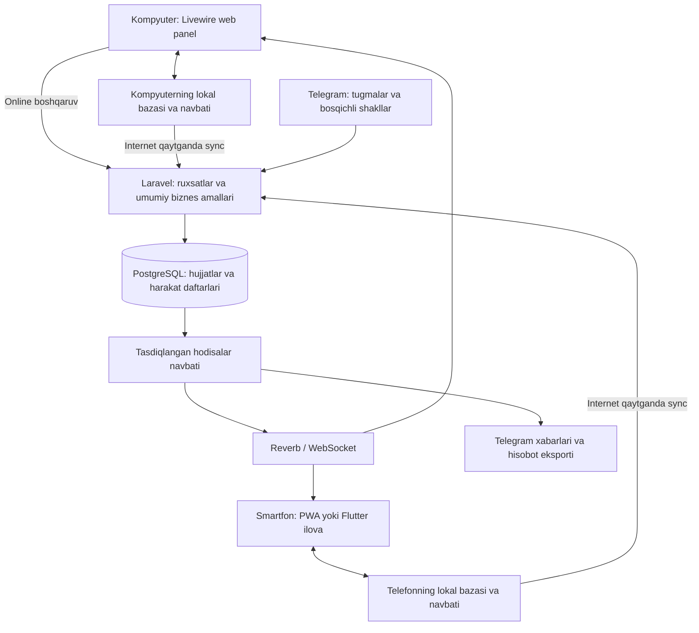

# Suv do‘koni CRM — kelishish uchun yangi arxitektura

Sana: 2026-10-03. Holat: muhokama uchun taklif, dasturga hali tatbiq etilmagan.

Ushbu hujjat foydalanuvchining yangi talablariga asoslanadi. Mavjud ilova ishlaydigan asos deb olinmaydi. Eski arxitektura fayllaridagi blok/yashik, ko‘p ombor yoki boshqa taxminlar ushbu hujjatga avtomatik ko‘chirilmaydi. Hozir faqat loyiha va hisob qoidalari kelishiladi; dastur kodi o‘zgartirilmaydi.

## 1. Tasdiqlangan ko‘lam va mahsulot maqsadi

| Masala | Kelishilgan talab |
|---|---|
| Biznes | Suv va ichimliklar sotadigan optom do‘kon |
| Tashkilot | Bitta do‘kon |
| Ombor | Bitta ombor |
| Miqdor | Faqat butun dona; optom savdo ham ko‘p dona sotish |
| Hajm | 0.5 L, 1 L, 1.5 L va foydalanuvchi qo‘shadigan boshqa hajmlar |
| Qurilmalar | Kompyuter, smartfon ilovasi, Telegram bot |
| Internet | Telefon va kompyuterda offline savdo; internet qaytganda avtomatik sinxronlash |
| Mijoz qarzi | Umumiy pul qarzi va to‘lovlar; to‘lovni mahsulotlarga taqsimlash talab qilinmaydi |
| Kirim | Mahsulot, hajm va ta’minotchini kirim oynasining o‘zida qo‘shish |
| Narx | Erkin sotuv narxi yoki mahsulot/hajmga belgilangan tizim narxi |

Mahsulotning maqsadi: do‘kondagi yuk, savdo, pul va qarz harakatlarini bir joyda ishonchli yuritish. Online operatsiya server tasdiqlagach boshqa qurilmalarni yangilaydi. Offline savdo qurilmaga doimiy saqlanadi, «Sinxronlash kutilmoqda» deb ko‘rsatiladi va internet qaytganda serverda bir marta qayd etiladi. Tugmani takror bosish, javob yo‘qolishi yoki qayta yuborish bir savdoni ko‘paytirmaydi.

Bu yerda «kassa» dasturiy pul daftari va kassir ish joyini anglatadi. Alohida kassa apparati dasturdan foydalanish uchun texnik shart bo‘lmaydi. Tashqi fiskal xizmat, terminal yoki bank integratsiyasi zarur bo‘lsa, u alohida integratsiya moduli sifatida loyihalanadi; CRM yozuvi bunday integratsiyani avtomatik bajargan hisoblanmaydi.

## 2. Asosiy arxitektura qarori

Taklif: Laravel asosidagi **modullarga ajratilgan yagona backend**, PostgreSQL bazasi, Livewire web interfeysi va shu backendga ulanadigan mobil hamda Telegram mijozlari.

Bir xil savdo, kirim yoki qarz to‘lovi uch xil backendda qayta yozilmaydi. Har bir interfeys umumiy biznes amallariga ulanadi. Server umumiy qoldiq, tannarx, qarz, pul va ruxsatlarning yakuniy hisobini yuritadi. Offline sotuv oynasi saqlangan katalog, ruxsat va qurilma limitlari bilan lokal summa/chek hisoblaydi; serverdagi yakuniy umumiy holat bilan lokal holat farqi aniq belgilanadi.

Serverdagi hodisalar navbati operatsiya bilan birga bazaga yoziladi va commitdan keyin worker tomonidan tarqatiladi. Kompyuter va telefonning lokal bazalari alohida; ular bir umumiy lokal bazani bo‘lishmaydi. Qurilmadagi yuborish navbati bilan serverdagi hodisa navbati ikki alohida mexanizm.

### Livewire va real vaqt sinxronlash

Livewire online shakllar, jadval, filtr, modal va shu sahifadagi yangilanishlar uchun ishlaydi. Boshqa telefon yoki kompyuterdagi o‘zgarishlarni darhol olish uchun unga Laravel Echo va WebSocket broadcasting qo‘shiladi. Bu Livewire’ning rasmiy real vaqt integratsiyasi bilan mos keladi. [Livewire 4 events](https://livewire.laravel.com/docs/4.x/events#real-time-events-using-laravel-echo).

Livewire’ning server amallari internet uzilganda ishlamaydi. Shu sabab Sotuv/POS sahifasi lokal ishlaydigan JavaScript/Alpine qatlami va qurilma bazasiga ega bo‘ladi; online bo‘lganda ham shu navbatdan foydalanadi. Faqat Livewire komponentini cache qilish offline savdoni ta’minlamaydi. Internet yo‘q paytda boshqa qurilmalar bilan real vaqt almashish bo‘lmaydi; aloqa qaytganda hisoblar moslashtiriladi.

Masalan, omborchi telefondan 150 dona Fanta kirim qiladi. Server saqlaydi. Ombor qoldig‘i kompyuterda yangilanadi; sotuv oynasida yangi mavjud miqdor ko‘rinadi; egaga tegishli dashboard yangilanadi. Xaridorning qarzi haqidagi hodisa faqat uni ko‘rishga ruxsati bor foydalanuvchilarga yuboriladi.

### Tavsiya qilinadigan texnologiyalar

| Qatlam | Taklif va vazifasi |
|---|---|
| Backend | Laravel; amaldagi qo‘llab-quvvatlanadigan versiya implementatsiya boshlanishida tekshiriladi |
| Web | Livewire 4, Blade, Tailwind; Sotuv uchun lokal JavaScript/Alpine qatlami |
| Baza | PostgreSQL; hujjatlar, moliya, ombor va tranzaksiyalar |
| Real vaqt | Laravel Reverb va Echo; yopiq, ruxsat bilan ochiladigan kanallar |
| Navbat/cache | Redis va queue worker; xabar, eksport, qayta urinish |
| Kompyuter/telefon lokal bazasi | PWA’da IndexedDB va Service Worker; Flutter’da SQLite |
| Smartfon | O‘rnatiladigan PWA yoki Flutter; katalog va sinxronlanmagan savdolar doimiy lokal bazada |
| Telegram | Bot API, webhook, xodimga bog‘langan Telegram ID |
| Fayllar | Yopiq fayl saqlash: nakladnoy rasmi, biriktirmalar, eksportlar |

PWA ham smartfon ekraniga ilova sifatida o‘rnatiladi. Flutter kerak bo‘lsa hisoblash mantiqi o‘zgarmaydi. Native Flutter ilovaning birinchi relizda majburiyligi hali kelishiladigan mahsulot qarori; smartfon orqali ishlash imkoniyati esa birinchi ishchi versiya talabidir.

## 3. Menyu va bo‘limlarning chegaralari

Foydalanuvchi aytgan yetti bo‘lim saqlanadi. Pul harakatlarini boshqarish uchun qo‘shimcha «Kassa va xarajatlar» bo‘limi tavsiya qilinadi.

| Bo‘lim | Asosiy vazifa | Ichki sahifalar |
|---|---|---|
| Umumiy dashboard | Do‘konning hozirgi holati va tanlangan davr natijasi | Ko‘rsatkichlar, ogohlantirishlar, oxirgi operatsiyalar |
| Savdo | Amalga oshgan savdolarni kuzatish va tahlil qilish | Savdolar tarixi, chek tafsiloti, qaytarishlar |
| Sotuv | Yangi savdoni amalga oshirish | Tezkor sotuv, mijozga sotuv, qoralamalar |
| Ombor | Tovar kirimi va qoldiq boshqaruvi | Qoldiqlar, kirim, harakatlar, kalkulyator, katalog/narxlar, inventarizatsiya, brak |
| Qarzdorliklar | Mijozlar va ta’minotchilar bilan pul hisoblari | Mijoz qarzi, bizning ta’minotchi oldidagi qarzimiz, to‘lovlar, hisob ko‘chirmasi |
| Hisobotlar | Savdo, foyda, pul, qarz va ombor tahlili | Davr hisobotlari, Excel/PDF eksport |
| Admin panel | Foydalanuvchilar va do‘kon sozlamalari | Rollar, qurilmalar/offline limitlar, integratsiyalar, audit, boshlang‘ich qoldiqlar, xizmat holati |
| Kassa va xarajatlar — taklif | Pul kelishi/ketishi va kun yakuni | Naqd/karta/bank, xarajatlar, o‘tkazmalar, kassa ochish/yopish |

«Savdo» — tarix va tahlil; «Sotuv» — yangi operatsiya. Mijoz va ta’minotchi kartalariga Sotuv, Kirim va Qarzdorliklardan kirish mumkin; bir xil ma’lumot qayta yaratilmaydi.

## 4. Katalog: mahsulot, hajm va variant

Uchta tushuncha alohida saqlanadi:

| Tushuncha | Misol | Nima uchun kerak |
|---|---|---|
| Mahsulot | Fanta | Nomi va umumiy guruhi |
| Hajm | 0.5 L = 500 ml | Dropdown uchun aniq hajm |
| Variant | Fanta + 0.5 L | Qoldiq, kirim tannarxi, tizim narxi va kam qoldiq chegarasi |

«Mahsulot» nomi operator tushunadigan aniq nom bo‘ladi. Fanta Orange va Fanta boshqa ta’m bir-biridan farq qilsa, alohida nom bilan yaratiladi; mavjud Fanta’ga tasodifan qo‘shib yuborilmaydi.

Mahsulotni qo‘shish uchun faqat nom yetadi. Server ichki ID va ko‘rinadigan kod beradi. Hajm nomi va qiymati saqlanadi; mahsulot+hajm birikmasi bir marta yaratiladi. Dona hisob birligi o‘zgarmaydi, litr faqat idish hajmini bildiradi.

Mahsulot nomida registr, ortiqcha bo‘shliq va oddiy apostrof farqlari normallashtiriladi. «Fanta», « fanta » takror mahsulot yaratmaydi. O‘xshash nomlar taklif qilinadi, ammo avtomatik birlashtirilmaydi. Hajm uchun 0.5 L, 0,5 L va 500 ml bir qiymat sifatida tan olinadi. Hajm musbat bo‘lishi va butun mlga aylanishi kerak.

Hajm dropdowni tanlangan mahsulotdagi mavjud variantlarni ko‘rsatadi. Pastida «+ Yangi hajm» turadi; umumiy hajmlar ro‘yxatidan tanlash yoki yangisini kiritish mumkin. Yangi hajm tanlangan mahsulotga ulanadi. Kirim tugallanmaganida katalog yozuvi qolishi mumkin, lekin unga ombor miqdori yoki pul avtomatik yozilmaydi.

Mahsulot kartasi: nom, kod, ixtiyoriy barcode, faollik. Variant kartasi: hajm, tizim sotuv narxi, kam qoldiq chegarasi, ixtiyoriy joylashuv va keyinchalik yaroqlilik nazorati. Katalogdagi tannarx operator tahrirlaydigan maydon bo‘lmaydi; uni kirim va ombor harakatlari hosil qiladi.

Tarixda ishlatilgan mahsulot/hajm o‘chirilmaydi, arxivlanadi. Nomi o‘zgarsa yangi ekranlar yangi nomni ko‘rsatadi, eski hujjatning saqlangan nom/hajm nusxasi saqlanadi.

## 5. Kirim jarayoni

### Kirim oynasi

Hujjat tepasida ta’minotchi dropdowni, «+ Ta’minotchi», ixtiyoriy nakladnoy raqami, izoh va sana turadi. Ta’minotchi topilmasa shu oynada nomi yoziladi; telefon, tashkilot nomi va manzil qo‘shimcha maydonlar. Server ID beradi va darhol tanlaydi.

Qatorlar: mahsulot → hajm dropdowni → dona soni → bir dona kirim narxi → jami. Bir hujjatda bir nechta mahsulot bo‘lishi mumkin. «+ Mahsulot» va «+ Hajm» qatorning o‘zida ishlaydi. Yangi yozuv yaratilganda qolgan qatorlar va kiritilgan narxlar yo‘qolmaydi.

Sotuv narxi kirimda majburiy emas. Uni keyin Katalog/Narxlar yoki sotuv oynasida belgilash mumkin.

### Ta’minotchiga to‘lov

Kirim oynasining oxirida uch variant bo‘ladi: to‘liq to‘langan, qisman to‘langan, hali to‘lanmagan. To‘langan summa va pul qaysi hisobdan ketgani ko‘rsatiladi. Bu qism moliya ruxsati bo‘lgan xodim uchun ochiladi. Omborchi bunday ruxsatsiz faqat tovarni qabul qiladi; tizim kirim majburiyatini yozadi va to‘lovni mas’ul xodim alohida qayd etadi. «Omborchi pul haqida ma’lumot kiritmadi» avtomatik «naqd to‘landi» degani bo‘lmaydi.

Oddiy kirimda ta’minotchi majburiy. Boshlang‘ich ombor qoldig‘i alohida hujjat orqali kiritiladi, soxta ta’minotchi bilan kirim qilinmaydi.

### Siz bergan misol

| Maydon | Qiymat |
|---|---|
| Mahsulot | Fanta |
| Hajm | 0.5 L |
| Miqdor | 150 dona |
| Bir dona kirim narxi | 5 000 so‘m |
| Jami kirim | 750 000 so‘m |
| Ta’minotchi | Abror Aka — Cola diller |

Tasdiqlanganda kirim hujjati, qatorlari, +150 dona ombor harakati, ombor qiymati, ta’minotchi hisobiga 750 000 so‘mlik majburiyat va audit bir tranzaksiyada yoziladi. Haqiqiy to‘lov bo‘lsa uning summasi majburiyatni kamaytiradi va kassadan chiqadi. Telegram bildirishnomasi saqlashdan keyin yuboriladi.

Kirim qoralama holatida qoldiqni o‘zgartirmaydi. Tasdiqlangan kirimni xohlagancha tahrirlab bo‘lmaydi; xatoni tuzatish yoki ta’minotchiga qaytarish alohida hujjat bilan amalga oshiriladi.

## 6. Sotuv jarayoni

### 6.1. Tezkor sotuv

Mijozsiz, to‘liq to‘lanadigan savdo: mahsulot → hajm → dona → bir dona narxi → to‘lov hisobi → tasdiqlash. Bir savatda bir nechta qator bo‘lishi mumkin. Tizim narxi checkboxi shu yerda ham ishlaydi.

Tezkor sotuvda nasiya tanlansa ilova mijozga sotuv rejimiga o‘tishni taklif qiladi va mijoz tanlamasdan tasdiqlamaydi. Umumiy «Noma’lum mijoz»ga qarz yozilmaydi.

### 6.2. Mijozga sotuv

Mijoz qidiriladi yoki «+ Yangi mijoz» oynasi ochiladi. Maydonlar: ism, telefon, manzil, do‘kon nomi. Telefon va do‘kon nomi ism o‘xshash bo‘lganda farqlashga yordam beradi; telefon foydali aloqa maydoni, lekin hamma mijoz uchun mavjud deb majbur qilinmaydi. Telefon bo‘lmasa mijoz ismi bilan birga do‘kon nomi yoki manzil talab qilinadi. Bir xil telefon mavjud bo‘lsa ogohlantirish chiqadi, chunki bitta raqam bir nechta do‘konda ham ishlatilishi mumkin.

Qidiruvda «Akmal — Bahor Market — telefon oxiri 4321 — Chilonzor» ko‘rinishida chiqariladi. Mijoz kartasida oldingi qarz/avans va yangi savdodan keyingi hisob ko‘rsatiladi.

### 6.3. To‘lov rejimlari

| Tanlov | Kiritiladigan summa | Shart | Natija |
|---|---|---|---|
| To‘liq to‘lov | Jami summa | To‘lov yoki mavjud avans jami summani qoplaydi | Ushbu savdodan yangi qarz yo‘q |
| To‘liq nasiya | Hozir to‘lov 0 | Mijoz majburiy | Jami savdo mijoz hisobiga yoziladi |
| Qisman nasiya | Hozir to‘lanayotgan summa | Mijoz majburiy; odatiy holatda 0 < to‘lov < jami | Qolgan summa qarz |

Naqd/karta/bank — pul o‘tgan hisob turi. To‘liq/qisman/to‘lanmagan — savdoning to‘lov darajasi. Ular alohida maydonlar bo‘ladi. Masalan, qisman nasiya savdosidagi hozirgi to‘lov naqd ham, karta orqali ham bo‘lishi mumkin. Bir savdo uchun ikki hisobga bo‘lib to‘lov qilish — qo‘shimcha imkoniyat; model bir nechta to‘lov yozuvini qo‘llaydi.

Nasiya oynasida jami, hozir to‘lov, yangi savdodan to‘lanmay qolgan summa, oldingi hisob va yakuniy mijoz qarzi ko‘rinadi. Avans bo‘lsa u alohida ko‘rsatiladi va qoplangan qism yangi pul tushumi sifatida yozilmaydi.

### 6.4. Narx qoidalari

- «Tizim narxi» yoqilgan: tanlangan mahsulot+hajmning standart narxi olinadi; qator narxi avtomatik hisoblanadi.
- O‘chirilgan: ruxsatli sotuvchi bir dona uchun kelishilgan narx kiritadi.
- Standart narx yo‘q bo‘lsa tizim tasodifiy narx tanlamaydi; «Narx belgilanmagan» deb erkin narx yoki narx belgilashni so‘raydi.
- Sotuvning erkin narxi katalog narxini avtomatik o‘zgartirmaydi.
- Narx musbat, miqdor butun musbat dona bo‘ladi. Tekin berish oddiy nol narxli savdo emas, sabab va ruxsat talab qiladigan alohida chiqim sifatida loyihalanadi.
- Tannarxdan past narx — ogohlantirish va alohida ruxsat. Tannarxni ko‘rish huquqi bo‘lmagan sotuvchiga aniq tannarx oshkor qilinmaydi.
- Online sotuv tasdiqlanishidan oldin tizim narxi o‘zgarsa, yangi jami qayta ko‘rsatiladi va qayta tasdiqlash olinadi. Offline savdo lokal tasdiqlangan paytdagi narx va narx versiyasini saqlaydi; keyingi syncda xaridorga kelishilgan narx yashirin qayta hisoblanmaydi. Eskirgan narxdan foydalanish auditda belgilanadi. Qoralama savdo narxi esa yangilanishi mumkin.

### 6.5. Tasdiqlash va savdo hujjati

Tasdiqlashdan oldin mavjud qoldiq, jami, to‘lov, qolgan qarz va mijoz tekshiriladi. Online savdoda server shu zahoti, offline savdoda sync paytida savdo, qatorlar, hisoblangan tannarx, ombor chiqimi, mijoz hisobidagi harakat, haqiqiy pul tushumi va auditni birgalikda yozadi. Offline qurilma bundan oldin savdoni, pul qabul qilinganini va o‘ziga ajratilgan qoldiq kamayishini lokal tranzaksiyada saqlaydi. Offline chekning holati va vaqtinchalik raqami aniq ko‘rinadi.

Elektron savdo hujjatida raqam, mahsulotlar/hajmlar, dona, narx, summa, sotuv paytidagi to‘lov va nasiya, mijoz hamda server vaqti ko‘rinadi. Keyingi qarz to‘lovlari alohida pul hujjatlari bo‘ladi; mahsulotlar bo‘yicha «qaysi donaga pul to‘landi» ajratilmaydi.

## 7. Savdo bo‘limi: tarix va kuzatuv

Filtrlar: bugun, kecha, shu hafta, o‘tgan hafta, shu oy, o‘tgan oy, yil+oy tanlash, istalgan kun va ikki sana orasidagi davr. Haftaning boshlanishi dushanba; ekrandagi vaqt Asia/Tashkent bo‘yicha.

Qo‘shimcha filtrlar: mijoz/do‘kon, sotuvchi, mahsulot, hajm, chek raqami, to‘lov darajasi, pul hisobi, web/mobile/Telegram manbasi, qaytarilgan yoki tuzatilgan hujjat.

Ko‘rsatkichlar: sof savdo summasi, cheklar soni, dona soni, to‘liq to‘langan savdolar, to‘liq nasiya, qisman nasiya, sotuv vaqtida naqd/karta/bank bilan to‘langan summalar, yangi nasiya, qaytarishlar, yalpi foyda.

«Savdo summasi», «o‘sha savdoda hozir to‘langan» va «davrda haqiqatan kelgan pul» alohida ko‘rsatiladi. Bir oy oldingi qarzning bugun to‘lanishi bugungi savdoga qo‘shilmaydi. To‘liq/qisman nasiya tasnifi sotuv tasdiqlangan paytdagi holatni bildiradi. To‘lovlar mahsulot yoki chek bo‘yicha taqsimlanmagani uchun eski chekni «bugun qarzi to‘liq yopilgan» deb avtomatik belgilamaymiz; joriy qarz mijoz kartasida yuritiladi.

Tarix jadvali: sana-vaqt, chek, mijoz/do‘kon, sotuvchi, jami, dastlabki to‘lov, dastlabki nasiya, hujjat holati, manba. Tafsilotda mahsulot qatorlari, vaqtlar, ruxsatga qarab tannarx/foyda, bog‘langan qaytarish va tuzatishlar ko‘rinadi.

## 8. Ombor bo‘limi

### 8.1. Qoldiqlar

Mahsulot nomi → uning hajmlari bo‘yicha guruhlangan ro‘yxat. Har qator: mahsulot, hajm, mavjud dona, kam qoldiq chegarasi, oxirgi kirim/sotuv, tizim narxi; moliya ruxsatiga ega xodimga tannarx, jami ombor qiymati va kutilayotgan sotuv qiymati.

Filtr va tartiblash: nom, hajm, eng kam/ko‘p qolgan, chegaradan past, nol qoldiq, sotuv narxi yo‘q, faol/arxivlangan, oxirgi kirim sanasi, uzoqdan beri sotilmagan. Hajmlar checkbox orqali bir yoki bir nechtasi tanlanadi. Qidiruvdan oldin serverda filtr qo‘llanadi, keyin sahifalash bajariladi.

### 8.2. Harakatlar tarixi

Har variant uchun boshlang‘ich qoldiq, kirim, sotuv, mijozdan qaytish, ta’minotchiga qaytarish, brak, inventarizatsiya va tuzatish ketma-ket ko‘rsatiladi. Harakatdan hujjatga o‘tish mumkin. Qo‘lda shunchaki «qoldiqni 150 qilib qo‘yish» bo‘lmaydi; sababli hujjat harakat yaratadi.

### 8.3. Inventarizatsiya va brak

Inventarizatsiyada tizimdagi dona, haqiqiy sanalgan dona va farq chiqadi. Dastlab farq hisoblanadi; mas’ul xodim tasdiqlagach ombor harakati yoziladi. Birinchi versiyada sanalayotgan variantlar bo‘yicha kirim/sotuv vaqtincha bloklanadi; sanash yakunlangach ochiladi. Sanashdan oldin shu variant bo‘yicha sotuvchi qurilmalarning pending savdolari sinxronlanadi, offline ajratmalari qaytariladi va blokni olgani tekshiriladi. Aloqasi yo‘q qurilmani serverdan bloklashning o‘zi uning offline sotuvini to‘xtatmaydi, shuning uchun bunday holatda yakuniy sanash/tasdiq kutiladi. Bu sanash paytidagi savdolarni farq bilan aralashtirmaydi.

Brak/singan/yaroqsiz chiqimida mahsulot, dona, sabab, ixtiyoriy rasm va mas’ul xodim saqlanadi. Ombor tannarxi kamayishi tegishli yo‘qotish hisobida aks etadi; u naqd pul chiqimi deb yozilmaydi.

Inventarizatsiya va tasdiqlanadigan tuzatishlar Odoo’dagi amaliyotlardan moslashtirilgan taklifdir. [Odoo inventory adjustments](https://www.odoo.com/documentation/19.0/applications/inventory_and_mrp/inventory/warehouses_storage/inventory_management/count_products.html).

### 8.4. Kam qoldiq va xarid tavsiyasi

Har variantga minimal dona chegarasi beriladi. Chegaradan past bo‘lsa dashboard va ruxsatli Telegram foydalanuvchisiga signal chiqadi. «Xarid kerak» ro‘yxati oxirgi ta’minotchi va sotilish tezligini ko‘rsatadi. Boshlanishida avtomatik xarid hujjati yaratilmaydi; operator qaror qiladi. Bu Odoo’dagi qayta buyurtma chegaralari yondashuvining soddalashtirilgan shakli. [Odoo reordering rules](https://www.odoo.com/documentation/19.0/applications/inventory_and_mrp/purchase/products/reordering.html).

### 8.5. Keyingi kengaytirish: partiya va yaroqlilik

Ichimliklar uchun partiya, ishlab chiqarilgan/yaroqlilik sanasi, muddati yaqin tovarlar va avval muddati tugaydigan partiyani chiqarish foydali. Hozircha bu majburiy kirim maydoni emas; keyingi bosqich taklifi. Yoqilsa partiyalar dona qoldiqlari bilan yuritiladi, muddati o‘tgan tovar oddiy savdoga chiqmaydi. Partiyani jismonan FEFO bilan tanlash va tannarxni o‘rtacha usulda hisoblash ikki alohida qoida. [Odoo FEFO removal](https://www.odoo.com/documentation/19.0/applications/inventory_and_mrp/inventory/shipping_receiving/removal_strategies/fefo.html).

## 9. Ombor kalkulyatori

Kalkulyator Ombor ichida alohida sahifa va dashboarddan tezkor havola bo‘ladi. Barcha mahsulot, bitta mahsulot yoki tanlangan mahsulotlar; hajmlar bo‘yicha checkboxlar; «Barchasini tanlash/tozalash» ishlaydi.

| Natija | Hisoblash |
|---|---|
| Dona | Tanlangan variantlarning mavjud donalari yig‘indisi |
| Kirim/tannarx bo‘yicha qiymat | Shu variantlarning joriy ombor qiymati yig‘indisi |
| Tizim narxida sotuv qiymati | Har bir variantda dona × tizim narxi, keyin yig‘indi |
| Kutilayotgan yalpi foyda | Sotuv qiymati − ombor tannarx qiymati |

Bu sotilmagan qoldiqning **kutilayotgan yalpi foydasi**. U haqiqiy savdo foydasi, kassadagi pul yoki sof foyda sifatida nomlanmaydi.

Sizning misolingiz: «Fanta — jami tannarx qiymati 500 000 000 so‘m», undan «1 L — 60 000 000 so‘m». Ikkala raqam ham bir xil qiymat turi bo‘yicha chiqariladi. Yonida tizim narxidagi qiymat va farq alohida turadi. 0.5 L va 1 L tanlansa faqat shu variantlar jamlanadi.

Tizim narxi yo‘q variantlar yashirin nol narx bilan hisoblanmaydi. «3 ta variant uchun sotuv narxi belgilanmagan» deb ko‘rsatiladi; to‘liq kutilayotgan foyda hali aniqlanmagani belgilanadi. Faqat narxi mavjud qismning natijasi alohida chiqarilishi mumkin.

«Taxminiy narxda hisoblash» rejimida foydalanuvchi har variant uchun vaqtinchalik narx kiritishi mumkin. Bu katalogni o‘zgartirmaydi. Katalog narxini saqlash uchun alohida ruxsatli «Tizim narxini yangilash» amali bo‘ladi. «Oxirgi kirim narxi» ma’lumot uchun ko‘rsatilishi mumkin, ammo ombor bahosi uning asosida qayta yozilmaydi.

## 10. Qarzdorliklar

Ikki tab: **mijozlar bizga qarzdor** va **biz ta’minotchilarga qarzdormiz**. Ularning summalari bir-biriga qo‘shilib bitta «qarz» bo‘lmaydi.

### Mijoz kartasi

Ism, do‘kon nomi, telefon, manzil, izoh, hisob holati, jami qarz/avans, ixtiyoriy kredit limiti va kelishilgan keyingi to‘lov sanasi. Quyida savdolar va qaytarishlar, alohida to‘lovlar, umumiy hisob ko‘chirmasi.

Har savdoda nimalar, qaysi hajm, nechta dona, qanday narx, qachon va kim tomonidan berilgani ko‘rinadi. To‘lov daftari pul miqdorini yuritadi; to‘langan mahsulot sonini aniqlamaydi. Hujjatning o‘zida dastlabki qisman to‘lov ma’lumoti qoladi, keyingi to‘lov mijozning umumiy hisobini kamaytiradi.

Kamera uchun qurilmada savdo sodir bo‘lgan vaqt, serverga kelgan vaqt va server tasdiqlagan vaqt alohida saqlanadi; sekund aniqligida Asia/Tashkent bilan ko‘rsatiladi. Offline qurilma vaqti oxirgi server vaqtiga nisbatan tekshiriladi va shubhali farq belgilanadi. «Operatsiya kiritilgan vaqt» bilan «tovar olib ketilgan vaqt» alohida: olib ketish vaqti qayd etilmagan bo‘lsa kamera voqeasi deb taxmin qilinmaydi. Ixtiyoriy «Tovar berildi» belgisi, vaqt, mas’ul xodim va izoh qo‘shiladi. Kamera tizimiga avtomatik ulanish hozirgi ko‘lamga kirmaydi.

To‘lov qabul qilishda mijoz, summa, naqd/karta/bank hisobi, izoh va sana ko‘rsatiladi. Tasdiqdan oldin qarzdan keyin qancha qolishi chiqadi. Qarzdan ortiq pul kelganda farq yo‘qolmaydi: ruxsatli xodim uni mijoz avansi sifatida tasdiqlashi yoki summani tuzatishi kerak.

Kredit limiti va muddat — qo‘shimcha nazorat. Limit oshsa ruxsatli egaga murojaat; muddat berilgan va o‘tgan bo‘lsa eslatma. Mijozning qarzi umumiy yuritilgani uchun aniq cheklar bo‘yicha «necha kun kechikkan» hisobi avtomatik da’vo qilinmaydi. Birinchi versiyada kelishilgan mijoz to‘lov sanasi ishlatiladi.

### Ta’minotchi kartasi

Nom, tashkilot/dealer nomi, telefon, manzil, jami majburiyat yoki avans; barcha kirimlar, qaytarishlar va to‘lovlar. «Ta’minotchiga to‘lov» haqiqiy pul chiqimini yozadi va ta’minotchi qarzini kamaytiradi. Kirimning o‘zi to‘lov emas.

Hisob ko‘chirmasi tanlangan davrdagi boshlang‘ich qarz/avans, harakatlar va yakuniy qarz/avansni beradi. Eksportda do‘kon ma’lumoti, mijoz/ta’minotchi va davr ko‘rsatiladi. Bu o‘zaro hisobni tekshirish uchun asos bo‘ladi.

Zoho Inventory to‘lovlarni alohida qayd etish, qisman to‘lov va ortiqcha summani ko‘rsatish imkonini beradi. Biz bu ajratishni olamiz, ammo sizning talabingiz bo‘yicha keyingi to‘lovlarni mahsulotlarga yoki cheklarga majburiy taqsimlamaymiz. [Zoho payments received](https://www.zoho.com/us/inventory/help/payments-received/payments-received.html).

## 11. Kassa va xarajatlar — qo‘shimcha tavsiya

Naqd pul, karta/terminal va bank hisoblari alohida ko‘rinadi. Karta to‘lovi qayd etilishi bankdan avtomatik tasdiq olinganini anglatmaydi; integratsiya bo‘lmaganda uni xodim tasdiqlangan to‘lov sifatida qayd qiladi.

Pul harakatlari: savdo to‘lovi, oldingi qarz to‘lovi, ta’minotchiga to‘lov, operatsion xarajat, qaytarishda refund, hisoblararo o‘tkazma, egadan mablag‘ kiritish yoki egaga mablag‘ chiqarish. Har birida hisob, summa, sabab, vaqt, xodim va manba hujjat bor.

Xarajat kategoriyalari: ijara, maosh, transport, kommunal, boshqa. Egaga pul chiqarish operatsion xarajat va foyda kamayishi deb avtomatik yozilmaydi; bu alohida pul harakati.

Kun/smena ochishda boshlang‘ich naqd qoldiq, yopishda tizim bo‘yicha kutilgan qoldiq va kassir sanagan haqiqiy naqd summa olinadi. Farq bo‘lsa sabab yoziladi. Farq mavjud bo‘lishi uni yashirin tuzatmaydi; ruxsatli tasdiqlangan farq hujjati pul daftariga yoziladi.

Kassadan chiqimda mavjud pul yetarliligi tranzaksiya ichida tekshiriladi. Bir naqd kassa uchun bir vaqtda bitta ochiq smena bo‘lishi taklif qilinadi; bir nechta sotuvchi shu smenaga o‘z nomi bilan operatsiya yozishi mumkin. Yopilgan smenaga yangi operatsiya yozilmaydi.

## 12. Dashboard

Yuqorida sana filtri va tezkor «Sotuv», «Kirim», «Qarz to‘lovi», «Xarajat» tugmalari.

| Blok | Ko‘rsatkichlar |
|---|---|
| Savdo | Davr savdosi, chek soni, sotilgan dona, qaytarishlar |
| To‘lov | Davrda kelgan haqiqiy pul, yangi nasiya; naqd/karta/bank ajratilgan |
| Foyda | Sotuv yalpi foydasi, xarajat, yo‘qotish va hisoblangan operatsion natija |
| Pul | Naqd/karta/bank qoldiqlari |
| Qarz | Mijozlardan olinadigan va ta’minotchiga to‘lanadigan summalar alohida |
| Ombor | Mavjud dona, tannarx qiymati, narxi mavjud qismning kutilayotgan foydasi |
| Ogohlantirish | Kam qoldiq, narx belgilanmagan, to‘lov sanasi o‘tgan, kassa farqi |
| Faollik | Oxirgi savdo, kirim, to‘lov va tuzatishlar |
| Sinxronlash | Oxirgi sync, qurilmalarning aloqa holati, ma’lum pending savdolar va tekshirish talab qiladigan holatlar |

Grafiklar: kunlar bo‘yicha savdo/pul tushumi, eng ko‘p sotilgan mahsulotlar, hajmlar kesimida savdo. Har bir kartadan tegishli filtrlangan ro‘yxatga o‘tish mumkin.

Davr savdosi oqim ko‘rsatkichi; kassa/qarz/ombor esa qoldiq ko‘rsatkichi. Hozirgi ko‘rinishda qoldiq «Hozirgi holat» deb yoziladi; tarixiy davr tanlansa «Davr oxiridagi qoldiq» alohida hisoblanadi. Masalan, sentabr savdosini ko‘rsatib yonida bugungi qarzni sentabr qarzi deb belgilash mumkin emas.

Rolga qarab dashboard farqlanadi: omborchi qoldiq/kirimni, sotuvchi savdo va zarur mijoz hisobini, egasi barcha moliyaviy bloklarni ko‘radi.

Qurilma offline bo‘lsa uning yangi savdolari serverga hali ma’lum emas. Shuning uchun server dashboardi «Barcha qurilmalar bo‘yicha to‘liq real vaqt» deb ko‘rsatilmaydi; oxirgi aloqa va hisobot to‘liqligi belgilanadi. Offline telefonda faqat oxirgi saqlangan umumiy ma’lumot va shu qurilmaning lokal yangi savdolari ko‘rinadi.

## 13. Hisobotlar

Hisobotlar bir xil sana va ruxsat qoidalaridan foydalanadi. Saqlangan filtr ko‘rinishlari, ekrandagi natija bilan bir xil Excel/PDF eksport, davr boshidagi/yakunidagi qoldiqlar taklif qilinadi. Eksportga do‘kon, davr, vaqt zonasi, tayyorlangan vaqt va sinxronlash to‘liqligi yoziladi.

| Hisobot | Savol va asosiy natija |
|---|---|
| Savdo | Kun/hafta/oy/davrda qancha savdo va nechta dona sotildi? |
| To‘lov darajasi | Sotuv paytida to‘liq to‘langan, to‘liq yoki qisman nasiya qancha? |
| Pul tushumi | Shu davrda naqd/karta/bank hisoblariga haqiqatan qancha pul keldi? |
| Yalpi foyda | Sof savdo summasi − sotilgan tovar tannarxi |
| Operatsion natija | Yalpi foyda − operatsion xarajat va boshqa tegishli yo‘qotishlar |
| Mahsulot/hajm | Eng ko‘p sotilgan, foyda keltirgan va sekin sotilgan variantlar |
| Kirim | Kimdan, qachon, nima, qancha dona va qanday narxda olindi? |
| Ombor qiymati | Hozir yoki tanlangan sana oxirida qoldiq va tannarx qiymati |
| Ombor harakati | Boshlang‘ich dona + kirim − chiqim = yakuniy dona |
| Mijozlar | Boshlang‘ich hisob, savdo/qaytarish/to‘lov, yakuniy qarz/avans |
| Ta’minotchilar | Boshlang‘ich hisob, kirim/qaytarish/to‘lov, yakuniy qarz/avans |
| Kassa | Har hisobning boshlang‘ich pul qoldig‘i, kirim, chiqim va yakun |
| Xarajatlar | Kategoriya, xodim va davr bo‘yicha operatsion xarajatlar |
| Smena | Tizim naqd qoldig‘i, sanalgan naqd, farq va tasdiqlovchi |
| Qaytarish/brak | Sabablar, dona, tannarx va tijorat qiymati |
| Narx o‘zgarishi | Kim, qachon, qaysi variant narxini o‘zgartirdi? |
| Xodimlar | Kirim/sotuv/to‘lovlar, erkin narx, tuzatishlar, offline operatsiyalar |
| Sinxronlash | Pending savdolar, kech kelgan yozuvlar, qayta yuborish va konfliktlar |

Haqiqiy yalpi foyda nasiya savdosida ham tovar sotilganda hisoblanadi. Keyin qarz to‘langanda yana foyda yoki savdo yaratilmaydi. Kirimga pul to‘lash ham tovar sotilgan tannarxni ikkinchi marta xarajat qilmaydi. Bu boshqaruv hisoboti; to‘liq soliq/buxgalteriya tizimining barcha imkoniyatlari birinchi relizga avtomatik kiritilmaydi.

## 14. Pul, qarz va tannarxning aniq qoidalari

### 14.1. Miqdor va pul aniqligi

Miqdor — butun dona. Bir dona sotuv/kirim narxi va pul hujjatlari — butun so‘m. Pul hisobida ikkilik `float` ishlatilmaydi. Umumiy qiymatlar butun so‘mda; o‘rtacha bir dona tannarxi ko‘rsatishda kasr bo‘lishi mumkin. Server va lokal mijozlar bir xil yaxlitlash qoidasini qo‘llaydi; maksimal miqdor/narx belgilangan chegarada tekshiriladi. API’da katta pul qiymatlari aniq decimal-string yoki mos integer kontrakti bilan uzatiladi, JavaScript aniqlik chegarasidan oshgan qiymat yashirin yaxlitlanmaydi.

Ombor modeli miqdor bilan birga jami tannarx qiymatini yuritadi. O‘rtacha tannarx = jami qiymat / jami dona. 100 dona 5 000 so‘mdan va 100 dona 6 000 so‘mdan kirsa: jami 200 dona, qiymat 1 100 000, o‘rtacha 5 500 so‘m.

Sotuvning tannarxi mavjud qiymatdan sotilgan miqdorga mutanosib ajratiladi. Butun so‘mga yaxlitlash qoidasi bitta bo‘ladi; qoldiqdagi qiymat eski qiymatdan ajratilgan tannarxni ayirish bilan olinadi. Oxirgi dona sotilganda qolgan tannarx to‘liq chiqariladi, qoldiq miqdor va qiymat 0 bo‘ladi. Shu tariqa yaxlitlash tufayli omborda «qolib ketgan pul» yo‘q.

Bir variant bir savdoda ikki xil narxli qatorlarda bo‘lishi mumkin, lekin **qoldiq tekshiruvi ularning jami donasi bo‘yicha** bajariladi. Tannarx qatorlarga izchil taqsimlanadi va qatorlar tannarxi yig‘indisi hujjat tannarxiga teng bo‘ladi.

### 14.2. Hisob tengliklari

| Hisob | Qoida |
|---|---|
| Savdo jami | Har qator dona × sotuv narxi yig‘indisi |
| Sof savdo | Tasdiqlangan sotuvlar − savdo qaytarishlari; tuzatishlar alohida hisobga olingan |
| Yalpi foyda | Sof savdo − qaytarishlar bilan moslashtirilgan sotilgan tannarx |
| Kassa qoldig‘i | Boshlang‘ich pul + haqiqiy tushumlar − haqiqiy chiqimlar |
| Mijozning imzolangan hisobi | Boshlang‘ich hisob + savdolar − qabul qilingan pul − qaytarish krediti + mijozga refund ± sababli tuzatish |
| Ta’minotchi imzolangan hisobi | Boshlang‘ich hisob + kirimlar − to‘lovlar − qaytarish krediti + ta’minotchidan refund ± sababli tuzatish |
| Ombor donasi | Boshlang‘ich + kirim + sotuvdan qaytish − sotuv − ta’minotchiga qaytarish − brak ± inventarizatsiya |

Imzolangan hisob musbat bo‘lsa qarz, manfiy bo‘lsa avans/kredit. Manfiy qiymatni `max(0, ...)` bilan yo‘qotish mumkin emas. UI qarz va avansni alohida chiqaradi. Mijozlar qarzi yig‘indisida bir mijoz avansi boshqa mijoz qarzini yashirmaydi.

Mijozli savdoda mijoz daftariga savdoning to‘liq summasi qo‘shiladi va shu paytdagi haqiqiy to‘lov ayiriladi. Faqat «qolgan qarzni qo‘shib», to‘lovni yana ayirish bilan ikki marta kamaytirish taqiqlanadi. Avansdan qoplash mavjud manfiy hisobni yangi savdo bilan kamaytiradi; unga yana ikkinchi soxta to‘lov yoki kassa tushumi yozilmaydi. Mijozsiz tezkor naqd savdoda mijoz qarz daftari yo‘q.

Ta’minotchi hisobi ham xuddi shunday: kirimning to‘liq summasi majburiyat, haqiqiy to‘lov esa kamaytiruvchi harakat. O‘sha pul chiqimi kassada bitta marta qayd etiladi.

### 14.3. To‘liq nazorat misoli

| Hodisa | Natija |
|---|---|
| Fanta 0.5 L, 150 dona × 5 000 kirim | Ombor 150 dona / 750 000 so‘m; ta’minotchi majburiyati 750 000 |
| Ta’minotchiga 300 000 to‘landi | Bizning qarz 450 000; pul −300 000 |
| Mijozga 60 dona × 6 500 sotildi | Savdo 390 000; sotilgan tannarx 300 000; yalpi foyda 90 000 |
| Mijoz savdoda 140 000 to‘ladi | Yangi mijoz qarzi 250 000; pul +140 000 |
| Omborda qolgan | 90 dona; tannarx qiymati 450 000 |
| Tizim narxi 7 000 bo‘lsa | Kutilayotgan sotuv 630 000; kutilayotgan yalpi foyda 180 000 |
| Keyin mijoz 100 000 to‘ladi | Qarz 150 000; pul +100 000; eski savdo/foyda o‘zgarmaydi |
| Keyin ta’minotchiga 50 000 to‘landi | Bizning qarz 400 000; pul −50 000 |

Bu hodisalar boshqa operatsiyasiz, boshlang‘ich naqd 500 000 so‘m bilan bitta kassada bajarilsa yakuniy naqd: 500 000 − 300 000 + 140 000 + 100 000 − 50 000 = **390 000 so‘m**. Mijoz qarzi, ta’minotchi qarzi va ombor qiymati bu naqdga qo‘shilmaydi.

### 14.4. Offline tannarx va kech kelgan operatsiyalar

Offline chekning sotuv narxi va qabul qilingan puli lokal tasdiqda o‘zgarmas saqlanadi. Qurilmadagi tannarx/foyda — oxirgi sync asosidagi taxminiy qiymat. Rasmiy ombor tannarxi server qabul qilgan harakatlarning yagona ketma-ketligida hisoblanadi; offline savdoning yakuniy tannarxi sync vaqtida yoziladi. Avval tasdiqlangan boshqa savdolarning tarixiy tannarxi yashirin o‘zgartirilmaydi.

Bu tanlov bilan «fizik sotuv bo‘lgan paytdagi mutlaq aniq umumiy tannarx» offline qurilmaga kafolatlanmaydi. Shunday hisob zarur bo‘lsa barcha kech kelgan harakatlarni vaqt bo‘yicha qayta baholash modeli kerak bo‘ladi; birinchi versiya uchun u tavsiya qilinmaydi. Hisobotda hodisa va server hisobga olgan vaqt ajratiladi.

## 15. Qaytarishlar va xatoni tuzatish

Qoralamani o‘zgartirish yoki tashlash mumkin. Tasdiqlangan savdo/kirim/to‘lov o‘chirilmaydi; unga bog‘langan qaytarish yoki teskari harakat hujjati yaratiladi. Sabab va bajaruvchi saqlanadi. To‘lov qaytarish bilan avtomatik o‘chmaydi.

Mijozdan qaytarish original savdo va qator bilan bog‘lanadi. Qaytarilayotgan dona oldin sotilgan, hali qaytarilmagan miqdordan oshmaydi. Tijorat krediti original sotuv narxiga, omborga qaytadigan tannarx original ajratilgan tannarxga asoslanadi. Qisman qaytarishlarning yakunida miqdor/qiymat yaxlitlash qoldig‘i to‘g‘ri yopiladi.

Yaroqli tovar omborga qo‘shiladi. Yaroqsiz qaytgan mahsulot sotiladigan qoldiqqa qo‘shilmaydi; qaytarish va brak bog‘langan harakatlar sifatida qayd qilinadi. Nasiya qaytarishda mijoz qarzi kamayadi. Pul qaytarish kerak bo‘lsa alohida refund kassadan chiqadi; umumiy mijoz kredit/qarziga mosligi tekshiriladi. Mijozsiz savdoda refund original savdo va ilgari qaytarilgan summalarga bog‘lanadi.

Ta’minotchiga qaytarishda dona ombordan chiqadi, tijorat krediti original kelishilgan narx bo‘yicha ta’minotchi hisobini kamaytiradi. Ombordan chiqariladigan qiymat joriy o‘rtacha tannarx bo‘yicha bo‘ladi; original tijorat qiymati bilan farq alohida baholash farqi sifatida aks etadi. Kirim narxini noto‘g‘ri yozishni tuzatish oddiy qaytarish emas, ruxsatli baholash/tuzatish hujjati bo‘ladi.

Haqiqiy savdo bo‘lganidan keyin uni «qoralama o‘chirildi» qilish taqiqlanadi. Offline hali sinxronlanmagan savdoni bekor qilish ham original ID’ga bog‘langan bekor/tuzatish amali bilan saqlanadi; navbatdan shunchaki yo‘qolmaydi.

## 16. Admin panel va ruxsatlar

| Rol | Odatiy imkoniyat |
|---|---|
| Egasi | Barcha ma’lumot, moliyaviy tasdiq, rollar, offline siyosati, yopilgan davr nazorati |
| Administrator | Kundalik tizim boshqaruvi; moliya huquqlari egasi bergan ruxsatga bog‘liq |
| Sotuvchi | Sotuv, ruxsatli mijozlar, savdo tarixi, ruxsat berilsa qarz to‘lovi |
| Omborchi | Kirim, katalog yaratish, qoldiq, inventarizatsiya qoralamasi; pul to‘lovi alohida huquq |
| Moliya xodimi | Kassa, xarajat, mijoz/ta’minotchi to‘lovlari, moliyaviy hisobot |

Bir odam bir nechta rolga ega bo‘lishi mumkin. Bu beshta xodim yollash sharti emas. Rollardan tashqari aniq ruxsatlar bo‘ladi: tannarx ko‘rish, narx belgilash, tannarxdan past sotish, nasiya, limitni oshirish, refund, inventarizatsiya tasdiqlash, hisob tuzatish, eksport va offline sotuv.

Admin panel tarkibi: do‘kon rekvizitlari, vaqt zonasi, hisoblar, foydalanuvchilar, qurilmalar, rollar, Telegram bog‘lash, kam qoldiq/kredit/offline limitlar, audit, sync konfliktlari, eksport va backup/worker/WebSocket holati.

Boshlang‘ich qoldiqlar alohida kiritiladi: ombordagi dona+tannarx, naqd/karta/bank, har bir mijoz va ta’minotchi qarzi yoki avansi. Oldindan hisoblangan summa faqat sababli ochilish hujjati bilan keladi. Demo mahsulotlar haqiqiy qoldiq sifatida avtomatik seed qilinmaydi.

Ruxsat faqat tugmani yashirish bilan tugamaydi: backend amali, API, eksport, bot va WebSocket kanalida tekshiriladi. Telegram akkauntini egasi bog‘laydi; username yoki telefon yozgani uchun xodim huquqi berilmaydi. Muhim tuzatishlar va yuqori xavfli hisob o‘zgarishlari online ruxsatli tasdiq talab qiladi.

## 17. Telegram bot

Bot xodimlar uchun qo‘shimcha ish interfeysi. Oddiy ko‘rish va amallar tugmalar bilan; uzun hujjat yoki ko‘p qatorli savdo uchun web/PWA havolasi ham beriladi. Ko‘p qatorli sotuv botda ham bosqichli savat bilan bajarilishi mumkin.

| Tugma/buyruq | Vazifa |
|---|---|
| Dashboard / Bugungi holat | Ruxsatga qarab savdo, pul, qarz va kam qoldiq |
| Kirim | Ta’minotchi → mahsulot → hajm → dona → kirim narxi → yakuniy tasdiq |
| Sotuv | Tezkor/mijoz → savat → narx → to‘liq/qisman/nasiya → tasdiq |
| Qoldiq | Mahsulot va hajm qidirish, mavjud/sotish uchun erkin dona |
| Qarzdorlik | Mijoz yoki ta’minotchi, karta va ko‘chirma |
| To‘lov | Mijozdan qabul qilish yoki ta’minotchiga to‘lash; tegishli ruxsat |
| Hisobot | Kun/oy/davr, qisqa natija yoki eksport |
| Kassa | Ruxsatli pul hisoblari va holati |
| Qoralamani bekor qilish | Hali amalga oshmagan bosqichli shakldan chiqish |

Mahsulot/hajm/ta’minotchi/mijozni qo‘shish tugmasi botda ham mavjud. Botdagi qidiruv ro‘yxatlari sahifalanadi. Bir nechta ochiq operatsiya chalkashmasligi uchun har qoralama ID va oxirgi tasdiq xabari bilan bog‘lanadi. Tugma callback’i actor, qoralama va holatga tekshiriladi.

Webhook maxfiy header bilan tekshiriladi; kelgan `update_id` takrori qayta ishlanmaydi. Tasdiq tugmasining takror bosilishi uchun bundan tashqari savdoning o‘z `operation_id`si qo‘llanadi. Telegram bu header va update identifikatorlarini rasmiy qo‘llaydi. [Telegram Bot API](https://core.telegram.org/bots/api#setwebhook).

Bildirishnomalar: kirim, savdo, to‘lov, kam qoldiq, kassa farqi, offline savdo serverga kelgani, sync tekshiruvi. Tijorat sirlarini umumiy ochiq guruhga yuborish standart holat bo‘lmaydi. Tannarx/foyda faqat ruxsatli egaga; mijozga hujjat yuborish alohida tanlov.

Telegram bot internet mavjud bo‘lganda ishlaydi; Telegram ichida kompyuter/telefon ilovasidagidek ishonchli offline savdo kiritish rejalashtirilmaydi. Telegram ishlamasa PWA/Flutter offline Sotuv ishlaydi. Bildirishnoma xatosi allaqachon saqlangan savdoni bekor qilmaydi.

## 18. Hujjat holatlari va ma’lumotlar modeli

Hujjat holati bilan sinxronlash holati alohida saqlanadi. `DRAFT` — hali amalga oshmagan; `POSTED` — server hisobga olgan; qisman/to‘liq qaytarish originalni o‘chirmay bog‘langan hujjatlar orqali hosil qilinadi. Offline qurilmada savdo `LOCALLY_RECORDED` bo‘lishi mumkin: u haqiqiy lokal savdo, lekin hali server hisobiga kirmagan.

Sync holatlari: `PENDING`, `SENDING`, `ACKNOWLEDGED`, `RETRYABLE`, `NEEDS_REVIEW`. Tarmoq xatosi savdoni biznes xatosi yoki yangi savdo qilib yubormaydi.

Quyidagi jadval konseptual model; hozir SQL yoki migratsiya yozilmaydi.

| Ma’lumot guruhi | Asosiy yozuvlar va bog‘lanishlar |
|---|---|
| Xodimlar | users, roles, permissions; actor va ruxsatlar |
| Qurilmalar | devices, offline_authorizations; qurilma, foydalanuvchi, ruxsat muddati/versiyasi |
| Katalog | products, volumes, product_variants; mahsulot+hajm yagona variant |
| Narx | price_history; eski/yangi narx, actor, vaqt, versiya |
| Mijoz/ta’minotchi | customers, suppliers; nom, telefon, manzil, do‘kon/tashkilot, hisob sozlamalari |
| Kirim | purchases, purchase_items; ta’minotchi, qatorlar, vaqt, summa |
| Savdo | sales, sale_items; mijoz, snapshotlar, dastlabki to‘lov/nasiya, manba |
| Pul hujjati | payments; kiruvchi/chiqadigan summa, hisob, taraf, original operatsiya |
| Mijoz hisobi | customer_ledger; savdo, to‘lov, qaytarish, refund, ochilish, tuzatish |
| Ta’minotchi hisobi | supplier_ledger; kirim, to‘lov, qaytarish, refund, ochilish, tuzatish |
| Ombor | inventory_movements, inventory_balances; variant, dona va tannarx qiymati |
| Offline qoldiq | inventory_allocations; qurilmaga ajratilgan sotish huquqi, iste’mol va qaytarish |
| Offline kredit | credit_allocations; qat’iy kredit limiti yoqilgan mijozlar uchun qurilma byudjeti |
| Kassa | cash_accounts, cash_movements, cash_sessions; pul hisoblari va smena |
| Xarajat | expenses; kategoriya, summa, pul hujjati va mas’ul |
| Qaytarish | returns, return_items; original savdo/kirimga bog‘langan |
| Inventarizatsiya/brak | inventory_counts, count_items, stock_adjustments; sabab va tasdiq |
| Fayllar | attachments; hujjatga bog‘langan yopiq fayllar |
| Ishonchli yuborish | outbox_events, notification_deliveries; saqlangan hodisa va yetkazish urinishlari |
| Sinxronlash | sync_operations, device_cursors, sync_change_log; operatsiya natijasi, cursor, entity versiya |
| Bot | telegram_accounts, bot_drafts, received_updates; xodim bog‘lanishi va qoralama |
| Nazorat | audit_logs, reconciliation_runs; o‘zgarishlar va hisob tengligi tekshiruvi |
| Keyingi bosqich | inventory_lots va lot balances/movements; partiya/yaroqlilik yoqilsa |

Har hujjatda: ichki ID, ko‘rinadigan raqam, `operation_id`, actor, device, manba, hodisa vaqti, server qabul/commit vaqti, holat, izoh va bog‘langan tuzatish ID mavjud. Vaqtlar bazada UTC, ekran va foydalanuvchi sana filtrlari Asia/Tashkentda; kun oralig‘i chegaralari serverda UTCga aylantiriladi. Eski hujjat uchun nom/hajm/narx nusxalari saqlanadi. Telefon yoki barcode ichki ID o‘rnini egallamaydi.

Offline yaratiladigan mijoz barqaror client UUID’ga ega. Server shu UUID uchun mijozni bir marta yaratadi yoki aniq bog‘langan ID’ni qaytaradi. Bir xil ism/telefon tufayli boshqa mijozga avtomatik ulash yo‘q; shubhali moslik tekshiriladi. Hali mijoz xaritasi aniqlanmagan savdo navbatda saqlanadi. Savdoda hozir olingan pul, avansdan qoplangan qism va yangi nasiya alohida snapshot maydonlar; avans haqiqiy pul tushumi bilan aralashtirilmaydi.

Unikal cheklovlar: normallashtirilgan mahsulot nomi, hajm ml, mahsulot+hajm, hujjat raqami, `operation_id`, bot update ID va harakatning manba hujjat/qator/harakat turi. Pul va miqdor chegaralari DB hamda serverda tekshiriladi. ID/raqamlar «eng katta ID + 1» bilan yaratilmaydi.

Daftarlar — hisobning asosi. `inventory_balances` va mijoz/ta’minotchi/kassa joriy qoldiqlari shu daftarlarning tranzaksiyada yangilanadigan tezkor natijasi. Ularni lokal kesh yoki qo‘lda yozilgan yakuniy summa almashtirmaydi.

## 19. Offline savdo va avtomatik sinxronlash

### 19.1. Lokal saqlash

Kompyuter va telefon PWA’sida IndexedDB: katalog, mijozlar, ruxsat snapshoti, qurilma limitlari, qoralama, lokal cheklar va yuborish navbati. Service Worker sotuv oynasining kerakli assetlarini oldindan saqlaydi. Flutter ilovada shu ma’lumotlar SQLite’da saqlanadi.

Bu oddiy xotiradagi massiv yoki `localStorage`ga qo‘yilgan yakuniy qoldiq bo‘lmaydi. Lokal savdo, savdo qatorlari, qabul qilingan pul, miqdor limiti kamayishi va navbat yozuvi **bitta lokal tranzaksiyada** saqlanadi. Disk/brauzer xatosida «Savdo saqlandi» ko‘rsatilmaydi.

Brauzer saqlash hajmi va persistence holati tekshiriladi, persistent storage so‘raladi; berilmasligi ham UI’da ko‘rinadi. Brauzer ma’lumotini tozalash yoki qurilma yo‘qolishi sinxronlanmagan savdoni server backupidan tiklamaydi. Pending yozuvlar borida chiqish/kesh tozalash/dastur yangilash ularni o‘chirmaydi; tiklash uchun yopiq eksport imkoniyati bo‘ladi. Web platformadagi saqlash va o‘chirilish qoidalari MDN’da hujjatlashtirilgan. [MDN storage quotas](https://developer.mozilla.org/en-US/docs/Web/API/Storage_API/Storage_quotas_and_eviction_criteria), [Flutter SQL persistence](https://docs.flutter.dev/app-architecture/design-patterns/sql).

Birinchi ishga tushirish, foydalanuvchini tanish, qurilmani ro‘yxatga olish, katalog/mijozlar va offline ruxsatni olish uchun internet kerak. O‘sha qurilmada ilgari ochilmagan sahifa yoki yuklanmagan ma’lumot offline mavjud deb ko‘rsatilmaydi.

### 19.2. Offline qaysi amallar ishlaydi?

| Amal | Birinchi ishchi versiya uchun taklif |
|---|---|
| Tezkor naqd sotuv | Lokal saqlash va belgilangan qoldiq limiti bilan ishlaydi |
| Mijozga to‘liq/qisman/nasiya savdo | Yuklangan mijoz/ruxsat bilan ishlaydi; kredit nazorati quyida |
| Yangi mijoz | Lokal UUID bilan yaratiladi; savdodan oldin serverga bog‘lanadi |
| Sotuv narxi | Saqlangan tizim narxi yoki ruxsatli erkin narx |
| Saqlangan qoldiq/mijoz hisobini ko‘rish | Oxirgi sync va lokal o‘zgarishlar belgilanadi |
| Mavjud katalogdagi tovar bilan sotuv | Qurilma ajratmasi doirasida ishlaydi |
| Yangi mahsulot/hajm va kirim | Offline qoralama saqlanadi; omborga rasmiy qabul qilish online |
| Alohida qarz to‘lovi, refund, xarajat | Birinchi bosqichda online; keyin alohida offline pul limitlari bilan kengaytirilishi mumkin |
| Tannarx o‘zgartirish, rol, inventarizatsiya tasdiq | Online |
| Umumiy yangi hisobot va bot amallari | Online; oldin saqlangan natija eskirgan belgi bilan ochiladi |

Bu chegaralar muhokama uchun: offline savdo foydalanuvchining majburiy talabi, offline kirim/xarajat/refund esa hozircha alohida talab qilinmagan. Ularni savdo bilan bir xil darajada qo‘shish pul/qoldiq rezervlarini kengaytiradi.

Offline karta/bank summasi «xodim to‘lovni tasdiqladi» bo‘lishi mumkin; ilova o‘zi terminal yoki bank ishlaganini kafolatlamaydi. Tasdiqlanmagan tashqi to‘lovni «pul olindi» deb qayd qilmaydi. Naqd to‘lov qabul qilinishi lokal chekda darhol yoziladi.

### 19.3. Internet qaytganda ketma-ketlik

1. Ilova serverga ulanishni tekshiradi; faqat telefonning Wi-Fi belgisi yetarli emas.
2. Navbatdagi yozuvlar qurilma va actor bilan o‘zgarmagan `operation_id`lar orqali yuboriladi. Yangi mijoz kabi bog‘liqliklar avval hal qilinadi; keyin ularga tegishli savdo.
3. Server har yozuvni tekshiradi, ruxsat/ajratma va biznes qoidalarini bajaradi, tranzaksiyani commit qiladi va eski yoki yangi natijani qaytaradi.
4. Qurilma `ACKNOWLEDGED`ni doimiy bazaga yozadi; server bergan hujjat ID/raqami lokal chekka ulanadi.
5. Serverdagi o‘zgarishlar cursor bo‘yicha olinadi; lokal katalog/qarz/qoldiq yangilanadi, qolgan pending o‘zgarishlar ustiga alohida qo‘llanadi.
6. Qayta urinish kerak bo‘lsa kutish oralig‘i oshiriladi. Tekshirish kerak bo‘lgan yozuv yashirilmaydi; UI va admin ro‘yxatida qoladi.

Har batch uchun har bir operatsiya alohida natijaga ega. Bitta savdo ichidagi qator/pul/qarz/ombor esa bo‘linmas tranzaksiya. Javob yo‘qolsa qurilma shu ID bo‘yicha natijani so‘raydi yoki aynan shu ID bilan qayta yuboradi. Navbat faqat server tasdiqi doimiy saqlangandan keyin yakunlangan bo‘ladi.

Ochiq ilova internet qaytganda, qayta ochilganda va qo‘lda «Sinxronlash» bosilganda navbatni yuboradi. Background Sync mavjud brauzerlarda qo‘shimcha ishlaydi, lekin ilova yopiq yoki OS uni to‘xtatgan holatda har qurilmada darhol sync kafolatlanmaydi. Keyingi ochilishda avtomatik davom etadi. [MDN offline/background operation](https://developer.mozilla.org/en-US/docs/Web/Progressive_web_apps/Guides/Offline_and_background_operation).

### 19.4. Ko‘p qurilmada offline qoldiq: tavsiya qilinadigan ajratma

100 dona mahsulotni ikki qurilma oxirgi syncda ko‘rib, keyin ikkalasi ham 80 donadan sotsa, ID himoyasi yetmaydi: bu ikki xil haqiqiy savdo. Global qoldiqni offline cheksiz yangilab bo‘lmaydi.

Taklif: server har qurilmaga variant bo‘yicha **offline sotishi mumkin bo‘lgan dona** ajratadi. Masalan: 100 donadan kompyuterga 60, telefonga 30, serverning umumiy erkin qoldig‘iga 10. Ajratma fizik tovarni boshqa omborga ko‘chirmaydi; shu miqdorni sotish huquqini rezerv qiladi.

- Offline qurilma o‘z ajratmasidan ko‘p sotmaydi; lokal savdo ajratmani kamaytiradi.
- Online savdo boshqa qurilmalarga ajratilmagan qoldiq yoki aynan o‘z ajratmasidan foydalanadi; boshqa qurilma rezervini yashirin sarflamaydi.
- Qurilma online bo‘lsa kerakli qo‘shimcha ajratmani erkin qoldiqdan avtomatik so‘rashi mumkin.
- Syncda server ajratmadan iste’molni, fizik qoldiq kamayishini va hujjatni birgalikda yozadi. Bir ajratma ikki marta sarflanmaydi.
- Ajratmalar yig‘indisi fizik mavjud qoldiqdan oshmaydi. Ko‘rinishda «Omborda jami» va «Bu qurilmada sotish mumkin» ajratiladi.
- Brak, ta’minotchiga qaytarish va qoldiq kamaytiruvchi inventarizatsiya ham rezervlarni hisobga oladi. Offline qurilmaga ajratilgan tovarni shu qurilma bilan muvofiqlashmasdan serverda boshqa chiqimga sarflash mumkin emas. Fizik shikast yoki favqulodda kamomad qayd etilsa alohida tekshirish/blok jarayoni ishga tushadi; ajratma mavjudligi tovar jismonan buzilmaganini kafolatlamaydi.
- Offline ruxsat muddati tugashi yangi sotuvni to‘xtatishi mumkin, ammo eski rezervni avtomatik boshqa qurilmaga bermaydi. Avval pending savdolar va ishlatilmagan qism muvofiqlashtiriladi.
- Qurilma yo‘qolsa/kesh tozalansa ajratma avtomatik qayta berilmaydi; egasi savdo va fizik qoldiqni tekshirib ruxsatli muvofiqlashtirish orqali hal qiladi.

Bu **tavsiya, hali tasdiqlangan biznes qarori emas**. Eng sodda muqobil: offline sotuvchi faqat bitta qurilma, qolganlari offline ko‘rish rejimida. Yana bir muqobil — barcha qurilmada umumiy oxirgi qoldiqdan sotishga ruxsat berib, ortiqcha sotuvni keyin konflikt sifatida hal qilish; u minus qoldiqni oldindan kafolatli oldini olmaydi. Telefon va kompyuterda parallel offline sotuv uchun ajratma yondashuvi tavsiya qilinadi.

### 19.5. Offline nasiya va vaqt/ruxsat konfliktlari

Mijozning oxirgi qarzi boshqa offline qurilmadagi yangi qarzni bilmaydi. Ekranda «Oxirgi syncdagi qarz + bu qurilmadagi savdolar» deb ko‘rsatiladi. Qat’iy kredit limiti yoqilsa bo‘sh kredit summasi ham qurilmalarga ajratiladi va online sotuv shu rezervni hisobga oladi. Ajratma bo‘lmasa qat’iy limit ostidagi mijozga yangi offline nasiya bloklanadi. Yangi offline mijoz uchun nasiya ruxsati va kichik umumiy qurilma byudjeti egasi sozlaydigan taklifdir.

Offline xodim ruxsati server bergan muddatli snapshot bilan ishlaydi. Ruxsatni serverda bekor qilish uzilgan qurilmaga o‘sha zahoti yetmaydi. Muddat va qurilmaga kirish himoyasi shu ta’sirni cheklaydi. Oldin lokal saqlangan haqiqiy savdo keyingi ruxsat o‘zgarishi sabab yo‘q qilinmaydi; tekshiruv talab qilsa admin hisobga olish/tuzatish orqali hal qiladi.

Qurilma vaqti, sotuv vaqti, oxirgi server vaqt tayanchi va serverga kelgan vaqt saqlanadi. Kech kelgan savdo yopilgan kunni yashirin qayta yozmaydi: kun hisoboti avval provisional bo‘ladi; barcha sotuvchi qurilmalar navbati muvofiqlashgach yakunlanadi. Egasi noma’lum pending mavjud bo‘lishi mumkin bo‘lgan holatda davrni majburan yopsa, kech kelgan yozuv tuzatish jarayoni va audit orqali kiritiladi.

## 20. Tugmani ko‘p bosish va qayta yuborishga himoya

Bu himoya savdo, kirim, to‘lov, xarajat, qaytarish va tuzatishlarga bir xil qo‘llanadi.

1. Har biznes operatsiyaga qoralama yaratilganda o‘zgarmaydigan UUID `operation_id` beriladi; har bosishda yangisi yaratilmaydi.
2. Lokal tasdiqda qoralama, payload va navbat ID bo‘yicha yagona yozuvga aylanadi. Bir nechta tab yoki ikki sync worker bir xil savdoni alohida qilib yaratmaydi; lokal atomik holat o‘tishi va navbatni egallash mexanizmi bo‘ladi.
3. Tugma birinchi bosishda bloklanadi va holat ko‘rsatiladi. Bu qulaylik, asosiy hisob himoyasi esa lokal hamda server unikal cheklovlari.
4. Server `operation_id` va payload fingerprintini tekshiradi. Shu ID+shu ma’lumot qayta kelsa **avvalgi chek va natija** qaytariladi.
5. Shu ID bilan boshqa summa/qator yuborilsa konflikt: original ma’lumot o‘zgarmaydi, yangi moliyaviy yozuv yaratilmaydi.
6. Bir vaqtning o‘zida kelgan takror so‘rovlar DB unikal cheklovi/lock bilan ketma-ket hal qilinadi. Operatsiya natijasi va hisob yozuvlari bir tranzaksiyada saqlanadi.
7. Tarmoq timeouti, ilovani qayta ochish, retry va background sync original ID’ni qayta ishlatadi. «Javob kelmadi» yangi savdo boshlash sababi emas.
8. Keyingi haqiqiy savdo uchun foydalanuvchi «Yangi savdo» yaratadi va yangi ID oladi. Bir xil mahsulot/summa bilan haqiqatan ikkita savdo bo‘lsa ular ikkalasi yoziladi; vaqt+summa bilan taxminiy dedup qo‘llanmaydi.

Qurilmada bitta savdo 20 marta yuborilsa: bitta savdo hujjati, bir dona tegishli ombor chiqimi, bir pul/qarz harakati va bir kanonik server natijasi bo‘lishi kerak. Transport kamida bir marta yetkazishi mumkin, lekin biznes ta’siri ID orqali bir marta bajariladi.

Botda `update_id` himoyasi har kelgan xabarni ajratadi; bir savdoning tasdiq tugmasi turli update’lar bilan bosilishi mumkinligi uchun `operation_id` baribir majburiy.

## 21. Real vaqt, tranzaksiya va server shartnomalari

Backend amallari: mahsulot/hajm/mijoz/ta’minotchi yaratish, kirimni qabul qilish, savdoni post qilish, to‘lov, qaytarish, xarajat, inventarizatsiya, narx o‘zgartirish, offline ajratma berish/iste’mol qilish va sync.

Har amal actor, qurilma/manba, `operation_id`, kutilgan versiya va tasdiqlangan ma’lumotni oladi. Natija: original operatsiya ID’si, server hujjat ID/raqami, holat, summa va tegishli hisoblar. Native ilova va lokal POS uchun versiyalangan API bo‘ladi; Livewire umumiy backend amallarini bevosita chaqirishi mumkin.

Server miqdor va to‘lovni mijoz yuborgan «jami foyda/qoldiq»dan ko‘chirib olmaydi. Takror variantlar miqdori jamlanadi, variantlar doim bir tartibda lock qilinadi, mijoz/ta’minotchi/pul hisoblari ham zarur lock bilan yangilanadi. Bitta kirim yoki savdoda xato bo‘lsa barcha moliyaviy va ombor yozuvlari rollback bo‘ladi.

Hodisalar: SalePosted, PurchasePosted, PaymentRecorded, StockChanged, PriceChanged, PartyBalanceChanged, CashBalanceChanged, ReturnPosted, SyncNeedsReview. Ular DB commitdan keyin tarqatiladi; tasdiqlanmagan yoki rollback bo‘lgan savdo «sotildi» bildirishnomasini yaratmaydi. Laravel broadcasting ham tranzaksiya commitidan keyin dispatch qilishni qo‘llaydi. [Laravel broadcasting](https://laravel.com/framework/docs/13.x/broadcasting#broadcasting-and-database-transactions).

Outbox bazada savdo bilan birga yoziladi; worker event/xabarni retry qiladi. Eventlar qayta kelishi mumkin, shuning uchun iste’molchilar event ID va entity versiyasini tekshiradi. Telegram HTTP javobi yo‘qolgan holatda xabar yetgan-yetmaganini mutlaq aniqlash cheklangan; bu biznes hujjatini qayta yaratishga olib kelmaydi.

WebSocket hodisasi faqat «yangilanish bor» degan signal va kerakli ID/versiyani olib yurishi mumkin. Mijoz ruxsatli endpointdan joriy ma’lumotni oladi. Aloqa qaytganda hodisalarni kutish bilan cheklanmay, cursor asosidagi o‘zgarishlarni tortadi. Arxivlangan yozuvlar ham belgi/tombstone bilan sinxronlanadi. Cursor faqat commit qilingan o‘zgarishlar oqimiga beriladi; kech commit bo‘lgan past ID yozuvni tashlab ketadigan «max ID» polling qo‘llanmaydi.

Yangilanishlar ochiq savat, modal va filtrni o‘chirib yubormaydi. O‘zgargan qoldiq/narx yonida belgi chiqadi; yangi operatsiya tasdiqida kerakli qayta tekshiruv amalga oshadi. Server umumiy yangilanishlarni tarqatadi, lokal pending savdolar esa alohida ustama qatlam sifatida saqlanadi.

## 22. Interfeys va qurilma talablari

Kompyuter: keng jadval, klaviatura bilan qidirish va Enter orqali qator qo‘shish, Tab ketma-ketligi, savat yonidagi to‘lov paneli. Telefon: katta bosiladigan tugmalar, pastda jami/tasdiq, miqdor/narx uchun raqamli klaviatura, mijoz va mahsulotni tez qidirish.

Mahsulot qo‘shish modali — faqat nom. Hajm modali — litr qiymati. Ta’minotchi modali — nom va ixtiyoriy aloqa. Mijoz modali — ism, telefon, manzil, do‘kon nomi. Saqlangach yangi yozuv darhol tanlanadi va sotuv/kirim qoralamasi davom etadi.

Holatlar foydalanuvchi tilida: «Online», «Offline», «Qurilmada saqlandi — 4 ta savdo yuborilmoqda», «Serverda saqlandi», «Tekshirish kerak». Offline qayd etish va server tasdiqi bir xil yashil «hammasi yangilandi» bo‘lmaydi. Oxirgi sync va qaysi qoldiq ko‘rsatilayotgani aniq.

Savdo/kirimda bo‘sh ro‘yxat, topilmadi, narx yo‘q, qoldiq yetarli emas, ulanish xatosi va lokal saqlash xatosi uchun alohida holat mavjud. Chek raqami tasdiqdan keyin chiqadi; savat yangi savdo sifatida faqat oldingi yozuv lokal yoki serverda ishonchli saqlangach tozalanadi.

## 23. Ishga tushirish va ishonchlilik talablari

Productionda alohida web jarayoni, queue worker, WebSocket jarayoni va scheduler bo‘ladi. Baza xatolari, navbatning kechikishi, outbox, sync konfliktlari, disk va backup holati kuzatiladi. Telegram ishlamay qolishi sotuvni to‘xtatmaydi; server ulanishi uzilishi tayyor offline POS’ni ishga tushiradi.

HTTPS, maxfiy sozlamalarni environment orqali boshqarish, yopiq fayllar, kirish himoyasi, xodim sessiyalarini boshqarish va offline qurilma PIN/ekran himoyasi talab qilinadi. Foydalanuvchi ruxsatidan ortiq katalog moliya ma’lumoti telefonga sinxronlanmaydi. Offline yangi login yoki umumiy admin huquqi berilmaydi.

Backup uchun DB nusxasi va biriktirma fayllari, oldingi holatga qaytarish hamda tiklash sinovi kerak. Muhokama uchun maqsad: sinxronlangan DB bo‘yicha RPO 15 daqiqagacha va RTO 2 soatgacha; infrastruktura va xarajatga qarab keyin tasdiqlanadi. Bu hali mavjud kafolat emas. Qurilmadagi pending savdolarga server backup kafolati tatbiq etilmaydi.

Yangi ilova/lokal baza versiyasiga o‘tishda navbat yo‘qolmaydigan migratsiya va eski payload formatini qabul qilish davri bo‘ladi. Pendinglar borida eskirgan ilovani shunchaki bloklab, yozuvlarni tashlab yuborish mumkin emas.

Reconciliation: ombor miqdori+qiymati, mijoz va ta’minotchi hisoblari, pul qoldig‘i hamda offline rezervlar o‘z daftarlariga tengligi muntazam tekshiriladi. Xato topilsa bildirish va sababli tuzatish, yashirin qoldiq almashtirish emas.

Taklif qilinadigan o‘lchanadigan maqsadlar: odatiy online sotuv server javobi 2 sekund atrofida yoki kam; online qurilmaga ko‘rinadigan yangilanish 2 sekund atrofida; lokal saqlash foydalanuvchini uzoq kutkazmasligi. Bu maqsadlar pilotda real qurilma, internet va yuklama bilan o‘lchanadi, hozir bajarildi deb da’vo qilinmaydi.

## 24. Qabul qilish ssenariylari

Kod yozilganda tekshiriladigan aniq talablar:

| Ssenariy | Kutiladigan natija |
|---|---|
| Fanta/0.5 L/ta’minotchi yo‘q | Shu kirim oynasida yaratiladi; qoralama yo‘qolmaydi |
| 150 dona × 5 000 kirim | +150 dona, 750 000 qiymat va majburiyat; to‘lov alohida |
| Fanta va « fanta », 0.5 va 0,5 L | Takror katalog/variant yaratilmaydi |
| Tizim narxi yoqilgan | To‘g‘ri variant narxi; narx yo‘q bo‘lsa ko‘rinadigan so‘rov |
| Qisman nasiya | Jami − haqiqiy to‘lov qarz; pul faqat olgan summaga oshadi |
| Mijozsiz nasiya | Tasdiqlanmaydi |
| Mijoz keyin pul to‘ladi | Umumiy qarz kamayadi; savdo/foyda ikkinchi marta yozilmaydi |
| Manfiy/nol narx yoki kasr dona | Oddiy savdoda qabul qilinmaydi |
| 100 dona, bir variant 60+60 qator | Jami 120 tekshiriladi; yetarli ajratma/qoldiq bo‘lmasa sotilmaydi |
| Tasdiq 20 marta bosildi | Bitta operatsiya, bitta chek va hisob ta’siri |
| Server yozdi, javob yo‘qoldi | Retry shu ID’ga eski natijani beradi |
| Offline savdo, app yopildi/qayta ochildi | Lokal chek va navbat saqlangan; savdo yo‘qolmaydi |
| Offline ilovada saqlash muvaffaqiyatsiz | «Saqlandi» chiqmaydi; qayta urinish bir xil ID bilan |
| Internet qaytdi, ilova ochiq | Pending avtomatik yuboriladi; server hisoblari va qurilmalar yangilanadi |
| Bir savdo ikki tab/worker tomonidan yuborildi | Shu ID bir marta qayd etiladi |
| Ikki qurilma offline, har biri alohida rezerv | Jami ajratmadan oshilmaydi; bir tovar ikki marta rezerv qilinmaydi |
| Offline narxdan so‘ng server narxi o‘zgardi | Sotilgan narx saqlanadi; versiya farqi auditda |
| Offline yangi mijozga savdo | Temp ID server mijoziga ulanadi; bog‘lanmagan qarz yo‘q |
| Ajratma/ruxsat konflikt | Savdo yo‘qolmaydi; tekshirish holati va mas’ul ko‘rinadi |
| Ta’minotchiga to‘lov | Pul kamayadi, majburiyat kamayadi; ombor o‘zgarmaydi |
| Qaytarish | Original miqdordan oshmaydi; ombor, qarz/refund to‘g‘ri |
| Qarzdan ortiq to‘lov | Farq avans, yashirin 0 qilib tashlanmaydi |
| Inventarizatsiya | Sanalayotgan variantga parallel yozuv bloklangan; farq hujjat bilan |
| Noto‘g‘ri rol/begona Telegram ID | Ma’lumot va amallarga ruxsat yo‘q |
| Sentabr tanlandi, oktabrda pul keldi | Sentabr savdosi va oktabr pul tushumi ajratilgan |
| Kech sync/yopilgan kun | Tarix yashirin o‘zgarmaydi; to‘liqlik yoki tuzatish belgisi |
| Backup tiklandi | Daftarlar va qoldiqlar teng; offline navbat alohida muvofiqlashtiriladi |

## 25. Qurish tartibi

Bu kod yozishni boshlash ruxsati emas; arxitektura kelishilgandan keyingi ketma-ketlik.

1. Biznes qoidalari: bo‘limlar, rollar, dona/narx, qarz va pul, offline ajratma qarorini yakunlash.
2. Hisob poydevori: baza, daftarlar, boshlang‘ich qoldiq, ruxsat, idempotency, audit va umumiy backend amallari.
3. Katalog va kirim: oynadan mahsulot/hajm/ta’minotchi, ombor qiymati va ta’minotchi hisobi.
4. Sotuv va mijoz: tezkor, to‘liq/qisman/nasiya, tizim/erkin narx, pul yozuvlari.
5. Offline POS: IndexedDB yoki SQLite, lokal tranzaksiya, navbat, ajratma, retry va yangi mijoz bog‘lanishi. Offline talabi relizdan oldingi majburiy qism.
6. Qarzdorlik va kassa: ikki taraf hisoblari, to‘lov, xarajat, smena, ko‘chirmalar.
7. Ombor kalkulyatori, inventarizatsiya, brak va qaytarishlar.
8. Dashboard, Savdo tahlili, hisobot/eksport, real vaqt va reconnect sync.
9. Telegram orqali ko‘rish va amallar; web/mobil bilan bir xil server qoidalari.
10. Pilot: real qurilmalarda uzilish, ko‘p bosish, parallel savdo, hisob muvofiqligi va tiklash sinovlari.

Birinchi ishchi relizda foydalanuvchi so‘ragan asosiy kirim/sotuv/qarz/kassa/qoldiq/kalkulyator/hisobotlar va telefon-kompyuter offline savdosi ishlaydi. Partiya/yaroqlilik, avtomatik xarid taklifi, kengaytirilgan offline pul chiqimi, bank/terminal integratsiyasi keyingi boyitish sifatida ajratiladi.

## 26. Kelishish uchun qolgan qarorlar

| Qaror | Hujjatdagi taklif |
|---|---|
| Telefon va kompyuter parallel offline qoldiq | Qurilmaga sotish mumkin bo‘lgan dona ajratish; miqdorlar egasi tomonidan/online avtomatik beriladi |
| Qo‘shimcha menyu | «Kassa va xarajatlar»ni alohida bo‘lim qilish |
| Telefon ilovasi | PWA bilan tez boshlash yoki Flutter’ni birinchi relizdan qilish |
| Offline kirim va alohida pul operatsiyasi | Dastlab offline savdo; qolganlarini bosqichma-bosqich kengaytirish |
| Tannarxdan past sotuv | Ruxsatli xodim, sabab va audit; oddiy sotuvchiga blok |
| Qat’iy kredit limitlari | Yoqilsa offline kredit byudjeti ham ajratiladi |
| Kassa intizomi | Bitta naqd kassa/smena; yopish va farqni egasi tasdiqlaydi |

Tasdiqlangan talablar: bitta do‘kon, bitta ombor, faqat dona, kompyuter va telefon offline savdosi, internet qaytganda sync, takror bosishda yagona yozuv. Jadvaldagi qolgan siyosatlar tavsiya bo‘lib turadi.

## 27. Tadqiqot manbalari va qo‘llanishi

Hujjatdagi biznes modeli foydalanuvchi talablari va shu do‘kon uchun taklifdir. Quyidagi rasmiy manbalardan faqat mos amaliyotlar olingan; Odoo yoki Zoho’ning barcha ishlash tartibi ko‘chirilmadi.

- [Livewire 4 events](https://livewire.laravel.com/docs/4.x/events#real-time-events-using-laravel-echo): online interfeys va Echo/WebSocket integratsiyasi.
- [Laravel broadcasting](https://laravel.com/framework/docs/13.x/broadcasting#broadcasting-and-database-transactions): commitdan keyingi event va yopiq kanal ruxsatlari.
- [Odoo inventory adjustments](https://www.odoo.com/documentation/19.0/applications/inventory_and_mrp/inventory/warehouses_storage/inventory_management/count_products.html): sanash va tasdiqlanadigan ombor tuzatishlari.
- [Odoo reordering rules](https://www.odoo.com/documentation/19.0/applications/inventory_and_mrp/purchase/products/reordering.html): minimal qoldiq va xarid ehtiyoji.
- [Odoo FEFO](https://www.odoo.com/documentation/19.0/applications/inventory_and_mrp/inventory/shipping_receiving/removal_strategies/fefo.html): keyingi partiya/yaroqlilik nazorati.
- [Zoho payments received](https://www.zoho.com/us/inventory/help/payments-received/payments-received.html): alohida to‘lovlar, qisman va ortiqcha summalarni ko‘rsatish.
- [Telegram Bot API](https://core.telegram.org/bots/api#setwebhook): webhook tasdig‘i va takror update’larni ajratish.
- [MDN storage quotas](https://developer.mozilla.org/en-US/docs/Web/API/Storage_API/Storage_quotas_and_eviction_criteria): lokal baza persistence va o‘chirilish chegaralari.
- [MDN offline/background operation](https://developer.mozilla.org/en-US/docs/Web/Progressive_web_apps/Guides/Offline_and_background_operation): Service Worker va background sync chegaralari.
- [Flutter SQL persistence](https://docs.flutter.dev/app-architecture/design-patterns/sql): native ilovadagi doimiy lokal baza.

